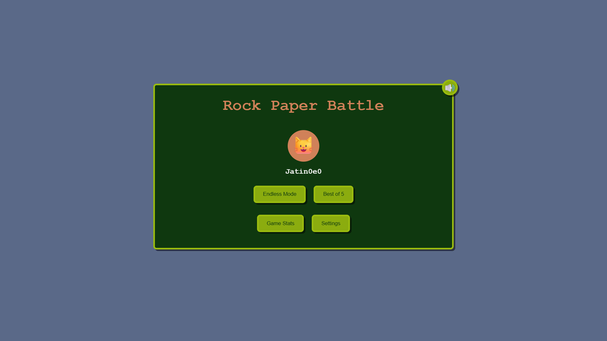
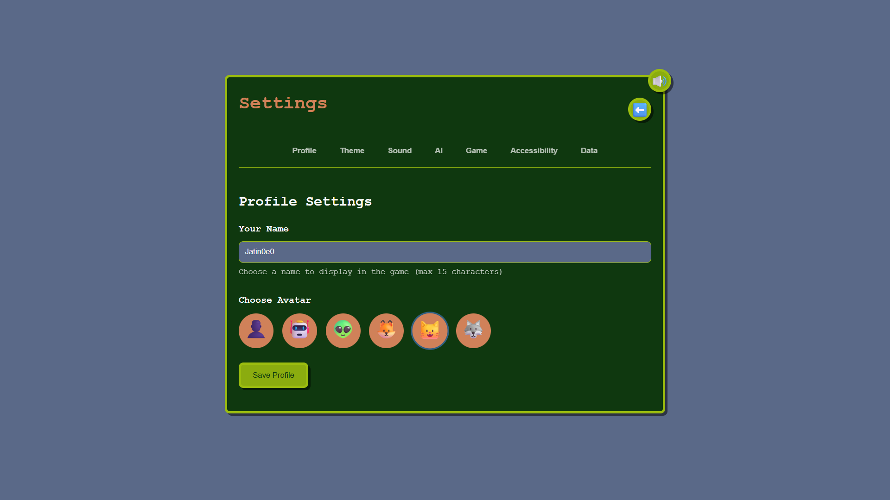
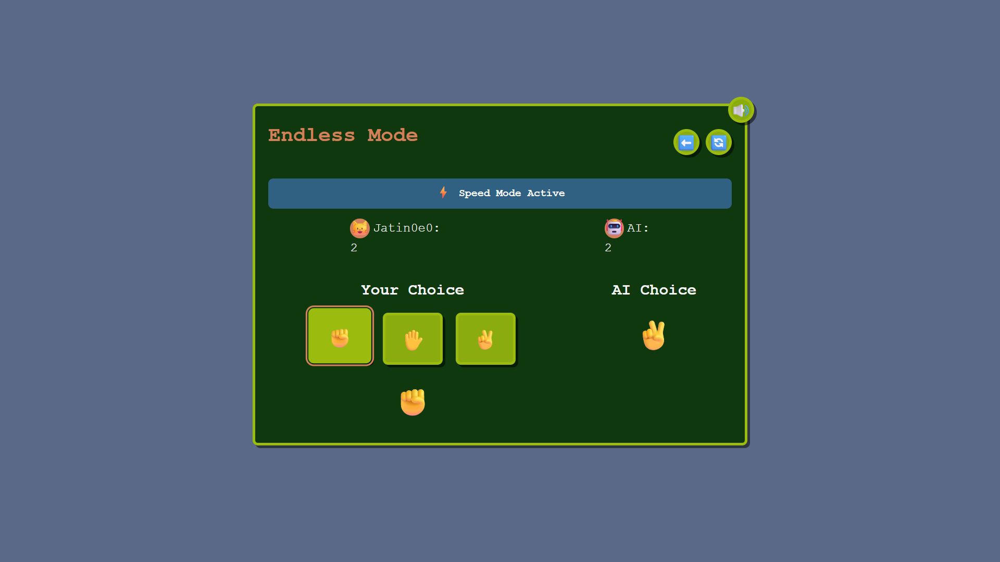
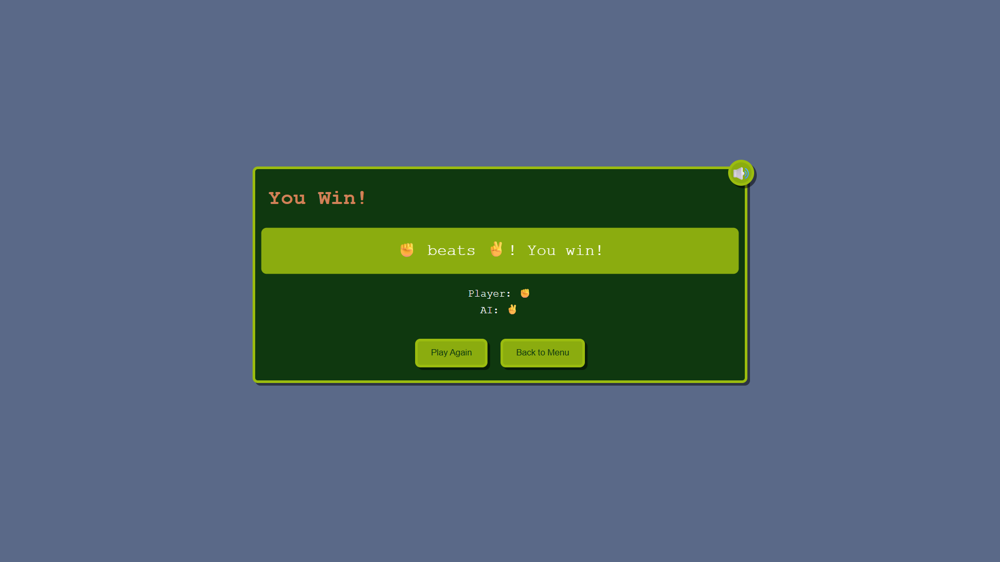
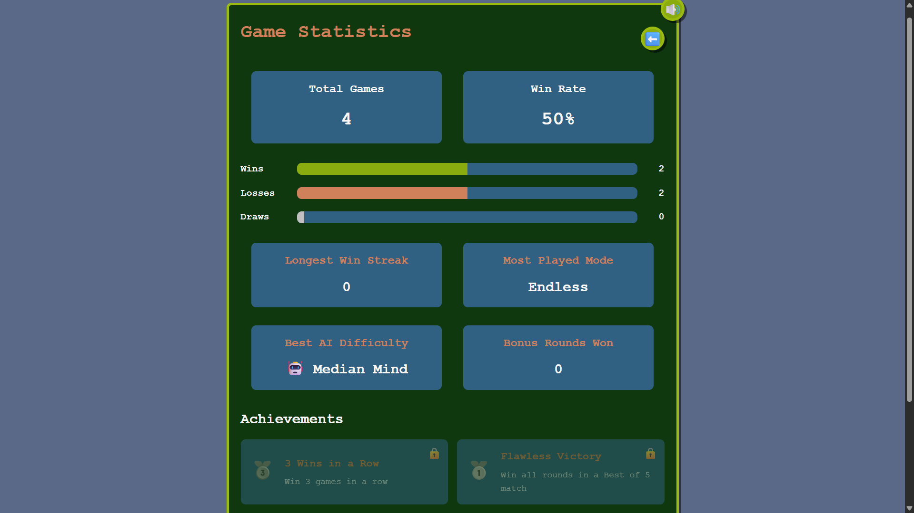

# Rock Paper Battle 🎮

A modern, feature-rich take on the classic Rock Paper Scissors game with stunning visuals, multiple game modes, AI opponents, and comprehensive accessibility features.

**Play here 👉🏻** - [https://rockpaperscissorbattle.vercel.app]

## Demo & Screenshots

### Main Menu


### Game Settings


### Gameplay



### Results & Stats



## Description

Rock Paper Battle is a comprehensive reimagining of the timeless Rock Paper Scissors game, built with modern web technologies. It features multiple game modes, intelligent AI opponents, achievement systems, and beautiful themes. The game is designed with accessibility in mind and offers a rich, engaging experience for players of all skill levels.

**Genre:** Strategy/Casual  
**Platform:** Web Browser  
**Players:** Single Player vs AI

## Features

### 🎯 Core Gameplay
- **Multiple Game Modes**: Endless Mode and Best of 5 tournaments
- **Smart AI Opponents**: Different difficulty levels with unique strategies
- **Speed Mode**: Fast-paced gameplay with time pressure
- **Bonus Rounds**: Special challenge rounds with unique rewards
- **Secret Moves**: Unlock special moves like Fire for enhanced gameplay

### 🎨 Visual & Audio
- **4 Beautiful Themes**: Day, Night, Retro, and Neon themes
- **Sound Systems**: Retro and Modern sound packs with ambient audio
- **Smooth Animations**: Polished UI transitions and effects
- **Responsive Design**: Works perfectly on desktop, tablet, and mobile

### 📊 Progression & Stats
- **Achievement System**: Unlock achievements for various accomplishments
- **Comprehensive Statistics**: Track wins, losses, streaks, and performance
- **Profile Customization**: Choose from multiple avatars and customize your name
- **Data Persistence**: All progress saved locally

### ♿ Accessibility
- **High Contrast Mode**: Enhanced visibility for users with visual impairments
- **Reduced Motion**: Disable animations for users sensitive to motion
- **Keyboard Navigation**: Full keyboard support for all interactions
- **Screen Reader Support**: ARIA labels and semantic HTML structure

## Installation

### Prerequisites
- Node.js 18.x or higher
- npm or yarn package manager

### Quick Start

1. **Clone the repository**
   ```bash
   git clone https://github.com/your-username/rock-paper-battle.git
   cd rock-paper-battle
   ```

2. **Install dependencies**
   ```bash
   npm install
   ```

3. **Run the development server**
   ```bash
   # For simple development server
   npm run simple
   
   # For Vite development server
   npm run dev
   
   # For production server
   npm start
   ```

4. **Open your browser**
   Navigate to `http://localhost:5000` (simple server) or `http://localhost:5173` (Vite dev server)

### Build for Production

```bash
# Build the project
npm run build

# Preview the production build
npm run preview
```

## How to Play

### Basic Rules
1. **Rock** beats **Scissors**
2. **Scissors** beats **Paper**  
3. **Paper** beats **Rock**
4. **Fire** (secret move) beats **Paper** and **Scissors** but loses to **Rock**

### Game Modes

#### Endless Mode
- Play unlimited rounds against the AI
- Track your win streak and overall performance
- Unlock achievements as you progress

#### Best of 5
- First to win 3 rounds wins the match
- Perfect for quick gaming sessions
- Competitive scoring system

### Controls
- **Mouse/Touch**: Click or tap move buttons to make your choice
- **Keyboard**: Use arrow keys to navigate, Enter to select, Escape to go back
- **Settings**: Access via the gear icon to customize your experience

### Special Features
- **Speed Mode**: Activated randomly, adds time pressure to decisions
- **Bonus Rounds**: Special challenge rounds with enhanced rewards
- **AI Difficulty**: Choose from multiple AI personalities and strategies

### AI Personalities
- 🤖 **Random**: The default AI that picks moves randomly
- 😏 **Cheeky**: This AI mimics your last move 40% of the time
- 🧠 **Predictive**: Analyzes your patterns and tries to counter your most-used moves

### Bonus Round Types
- 🎯 **Double Points**: Win this round for twice the points!
- 🔁 **Reverse Rules**: All win conditions are flipped (except for Fire)
- 🎲 **Chaos Mode**: Move labels are shuffled - can you figure out which is which?

### Achievements
- 🥉 **3 Wins in a Row**: Win three games consecutively
- 🥇 **Flawless Victory**: Win a Best of 5 match without losing any rounds
- 📊 **10 Total Rounds Played**: Play a total of 10 rounds across any mode

## Technologies Used

### Frontend
- **HTML5**: Semantic markup with accessibility features
- **CSS3**: Modern styling with CSS Grid, Flexbox, and custom properties
- **Vanilla JavaScript**: Pure ES6+ JavaScript for optimal performance
- **Web APIs**: Local Storage, Audio API, Intersection Observer

### Build Tools
- **Vite**: Fast build tool and development server
- **Express.js**: Production server for static file serving
- **Node.js**: Runtime environment

### Development
- **ESLint**: Code linting and consistency
- **Modern ES6+**: Classes, modules, async/await, destructuring
- **Responsive Design**: Mobile-first approach with progressive enhancement

## Project Structure

```
rock-paper-battle/
├── api/                    # Express.js server configuration
├── assets/                 # Game assets (audio, images, icons)
│   ├── audio/             # Sound effects and ambient audio
│   ├── icons/             # App icons and favicons
│   ├── images/            # Game images and graphics
│   └── screenshots/       # Documentation screenshots
├── css/                   # Stylesheets
│   ├── style.css         # Main styles
│   ├── themes.css        # Theme definitions
│   ├── animations.css    # Animation effects
│   ├── responsive.css    # Mobile responsiveness
│   └── high-contrast.css # Accessibility styles
├── js/                    # JavaScript modules
│   ├── game/             # Core game logic
│   ├── features/         # Feature implementations
│   ├── settings/         # Settings and storage
│   └── utils/            # Utility functions
├── dist/                  # Built files (generated)
├── public/               # Public assets
├── index.html            # Main HTML file
├── serve.py             # Python server wrapper for Replit
├── simple-server.js     # Simple Node.js server
└── vite.config.js       # Vite configuration
```

## Contributing

We welcome contributions! Here's how you can help:

### Getting Started
1. Fork the repository
2. Create a feature branch (`git checkout -b feature/amazing-feature`)
3. Make your changes
4. Test thoroughly across different browsers and devices
5. Commit your changes (`git commit -m 'Add amazing feature'`)
6. Push to the branch (`git push origin feature/amazing-feature`)
7. Open a Pull Request

### Areas for Contribution
- **New Game Modes**: Tournament modes, multiplayer, time trials
- **AI Improvements**: More sophisticated AI strategies
- **Accessibility**: Enhanced screen reader support, more accessibility options
- **Themes**: New visual themes and customization options
- **Localization**: Multi-language support
- **Performance**: Code optimization and bundle size reduction

### Code Style
- Use modern ES6+ JavaScript features
- Follow existing code patterns and naming conventions
- Maintain accessibility standards (WCAG 2.1 AA)
- Write meaningful commit messages
- Test across different browsers and devices

## License

This project is licensed under the MIT License - see the [LICENSE](LICENSE) file for details.

```
MIT License

Copyright (c) 2025 Rock Paper Battle

Permission is hereby granted, free of charge, to any person obtaining a copy
of this software and associated documentation files (the "Software"), to deal
in the Software without restriction, including without limitation the rights
to use, copy, modify, merge, publish, distribute, sublicense, and/or sell
copies of the Software, and to permit persons to whom the Software is
furnished to do so, subject to the following conditions:

The above copyright notice and this permission notice shall be included in all
copies or substantial portions of the Software.

THE SOFTWARE IS PROVIDED "AS IS", WITHOUT WARRANTY OF ANY KIND, EXPRESS OR
IMPLIED, INCLUDING BUT NOT LIMITED TO THE WARRANTIES OF MERCHANTABILITY,
FITNESS FOR A PARTICULAR PURPOSE AND NONINFRINGEMENT. IN NO EVENT SHALL THE
AUTHORS OR COPYRIGHT HOLDERS BE LIABLE FOR ANY CLAIM, DAMAGES OR OTHER
LIABILITY, WHETHER IN AN ACTION OF CONTRACT, TORT OR OTHERWISE, ARISING FROM,
OUT OF OR IN CONNECTION WITH THE SOFTWARE OR THE USE OR OTHER DEALINGS IN THE
SOFTWARE.
```

## Credits

### Inspiration
- Classic Rock Paper Scissors game mechanics
- Modern web game design principles
- Accessibility-first development approach

### Resources
- **Emoji Graphics**: Unicode Consortium emoji set
- **Sound Design**: Custom audio effects and ambient tracks
- **Color Schemes**: Carefully crafted theme palettes for optimal user experience

### Special Thanks
- Web accessibility community for guidelines and best practices
- Modern JavaScript community for development patterns
- Beta testers and feedback contributors

## Contact

### Developer
- **GitHub**: [Your GitHub Profile](https://github.com/jatinsharma0e0)
- **Email**: [jatin0e0help.com](mailto:jatin0e0help.com)

### Feedback & Support
- **Issues**: Report bugs and request features on [GitHub Issues](https://github.com/jatinsharma0e0/rock-paper-battle/issues)
- **Discussions**: Join the conversation in [GitHub Discussions](https://github.com/jatinsharma0e0/rock-paper-battle/discussions)
- **Contributing**: See the [Contributing](#contributing) section above

---

**Enjoy playing Rock Paper Battle!** 🎮✊✋✌️